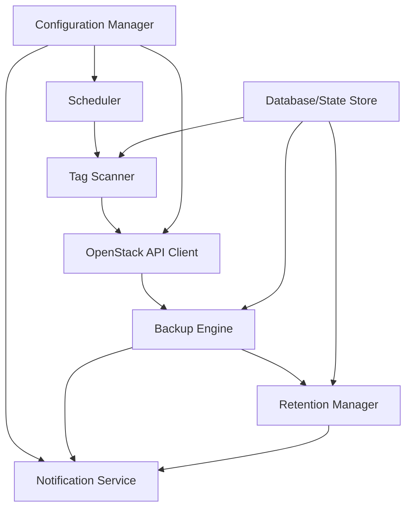

# Design Document

## Overview

Das OpenStack Backup Automation System ist eine Python-basierte Lösung, die automatisierte Backup- und Snapshot-Operationen für OpenStack-Ressourcen basierend auf Tags durchführt. Das System kombiniert flexible Scheduling-Mechanismen mit robusten Backup-Strategien und umfassendem Error Handling.

## Architecture

### High-Level Architecture



### Core Components

1. **Scheduler**: Verwaltet Zeitpläne und triggert Backup-Operationen
2. **Tag Scanner**: Scannt OpenStack-Ressourcen nach relevanten Tags
3. **OpenStack API Client**: Abstrahiert OpenStack-API-Aufrufe
4. **Backup Engine**: Führt Backup- und Snapshot-Operationen durch
5. **Retention Manager**: Verwaltet Backup-Bereinigung basierend auf Policies
6. **Configuration Manager**: Lädt und verwaltet Systemkonfiguration
7. **Notification Service**: Sendet E-Mail-Benachrichtigungen
8. **Database/State Store**: Persistiert Backup-Historie und Metadaten

## Scheduling Strategy

### Ansatz 1: Cron-basiertes Scheduling (Empfohlen)

**Vorteile:**
- Bewährte, zuverlässige Technologie
- Einfache Integration in bestehende Systeme
- Keine zusätzlichen Daemon-Prozesse erforderlich
- Einfaches Setup und Wartung

**Implementierung:**
- Hauptskript läuft alle 15 Minuten via Cron
- Prüft alle registrierten Ressourcen auf fällige Backups
- Verwendet lokale SQLite-Datenbank für State-Management

### Ansatz 2: Daemon mit internem Scheduler

**Vorteile:**
- Präzisere Zeitsteuerung
- Kontinuierliches Monitoring möglich
- Bessere Fehlerbehandlung bei laufenden Operationen

**Nachteile:**
- Komplexere Deployment-Strategie
- Zusätzlicher Service-Management-Overhead

### Gewählter Ansatz: Hybrid

Das System unterstützt beide Modi:
- **Cron-Modus** (Standard): Für einfache Deployments
- **Daemon-Modus**: Für erweiterte Monitoring-Anforderungen

## Components and Interfaces

### 1. Configuration Manager

```python
class ConfigurationManager:
    def load_config(self, config_path: str) -> Config
    def get_openstack_credentials(self) -> OpenStackCredentials
    def get_email_settings(self) -> EmailSettings
    def get_retention_policies(self) -> Dict[str, RetentionPolicy]
```

**Konfigurationsdatei (YAML):**
```yaml
openstack:
  auth_method: "application_credential"  # oder "password"
  application_credential_id: "..."
  application_credential_secret: "..."
  auth_url: "https://openstack.example.com:5000/v3"
  project_name: "backup-project"

backup:
  full_backup_interval_days: 7
  retention_days: 30
  max_concurrent_operations: 5  # Anzahl paralleler Backup/Snapshot-Operationen
  operation_timeout_minutes: 60  # Timeout für einzelne Operationen
  
notifications:
  email_recipient: "admin@example.com"
  email_sender: "backup-system@example.com"

scheduling:
  mode: "cron"  # oder "daemon"
  check_interval_minutes: 15
```

### 2. Tag Scanner

```python
class TagScanner:
    def scan_instances(self) -> List[ScheduledResource]
    def scan_volumes(self) -> List[ScheduledResource]
    def parse_schedule_tag(self, tag: str) -> ScheduleInfo
    def is_backup_due(self, resource: ScheduledResource) -> bool
```

**Tag-Parsing-Logik:**
- Format: `{TYPE}-{FREQUENCY}-{TIME}`
- Beispiele: `BACKUP-DAILY-0300`, `SNAPSHOT-MONDAY-1200`
- Validierung gegen erlaubte Werte
- Zeitzone-Behandlung (UTC als Standard)

### 3. Backup Engine

```python
class BackupEngine:
    def __init__(self, max_concurrent_operations: int = 5):
        self.executor = ThreadPoolExecutor(max_workers=max_concurrent_operations)
        self.semaphore = asyncio.Semaphore(max_concurrent_operations)
    
    async def create_instance_snapshot(self, instance_id: str, name: str) -> str
    async def create_volume_snapshot(self, volume_id: str, name: str) -> str
    async def create_volume_backup(self, volume_id: str, name: str, backup_type: str) -> str
    async def verify_backup_success(self, backup_id: str, resource_type: str, timeout_minutes: int) -> bool
    
    async def execute_parallel_operations(self, operations: List[BackupOperation]) -> List[OperationResult]
```

**Optimierte Backup-Verification:**
- **Kompakte Implementierung**: Vereinfachte verify_backup_success Methode (20 Zeilen statt 55)
- **Timeout-Handling**: Konfigurierbare Timeouts mit intelligenter Polling-Strategie
- **Error-Handling**: Robuste Fehlerbehandlung mit strukturiertem Logging

**Parallel Execution Strategy:**
- **Thread Pool**: Konfigurierbare Anzahl paralleler Worker (Standard: 5)
- **Semaphore**: Begrenzt gleichzeitige OpenStack-API-Aufrufe
- **Async/Await**: Effiziente Ressourcennutzung während Wartezeiten
- **Operation Queuing**: Intelligente Priorisierung (Snapshots vor Backups)

**Backup-Strategien:**
- **Snapshots**: Direkte OpenStack-Snapshot-API (parallel ausführbar)
- **Full Backups**: Cinder-Backup-Service (parallel ausführbar)
- **Incremental Backups**: Basierend auf letztem Full- oder Incremental-Backup

### 4. State Management

```python
class StateManager:
    def record_backup(self, resource_id: str, backup_info: BackupInfo)
    def get_last_backup(self, resource_id: str) -> Optional[BackupInfo]
    def get_backup_chain(self, resource_id: str) -> List[BackupInfo]
    def cleanup_old_records(self, retention_days: int)
```

### Defensive Backup Strategy

Das System implementiert eine **defensive Backup-Strategie**, die sicherstellt, dass neu getaggte Ressourcen sofort geschützt werden:

**Sofortige Backup-Erstellung:**
- Wenn eine Ressource einen Backup-Tag erhält, wird beim nächsten Scan-Zyklus (alle 15 Minuten) sofort ein Backup erstellt
- Dies gewährleistet, dass die Ressource innerhalb von maximal 15 Minuten nach dem Tagging geschützt ist
- Die zweite Sicherung erfolgt dann entsprechend dem konfigurierten Zeitplan (z.B. bei DAILY-Backups innerhalb von 24 Stunden)

**Beispiel-Szenario:**
1. **10:30 Uhr**: Administrator fügt Tag `BACKUP-DAILY-0300` zu einer Instanz hinzu
2. **10:45 Uhr**: Nächster Scan-Zyklus erkennt die neue Ressource und erstellt sofort ein Full-Backup
3. **03:00 Uhr (nächster Tag)**: Reguläres tägliches Backup wird erstellt (Incremental, da Full-Backup < 7 Tage alt)
4. **03:00 Uhr (folgende Tage)**: Weitere tägliche Incremental-Backups bis zum nächsten Full-Backup-Intervall

**Vorteile der defensiven Strategie:**
- **Sofortiger Schutz**: Keine Wartezeit bis zum nächsten geplanten Backup-Zeitpunkt
- **Minimales Risiko**: Ressourcen sind innerhalb von Minuten nach dem Tagging geschützt
- **Nahtlose Integration**: Nach dem ersten Backup folgt das System dem normalen Zeitplan
- **Benutzerfreundlich**: Administratoren müssen nicht auf den nächsten Backup-Zeitpunkt warten

**Datenbank-Schema (SQLite):**
```sql
CREATE TABLE backups (
    id INTEGER PRIMARY KEY,
    resource_id TEXT NOT NULL,
    resource_type TEXT NOT NULL,  -- 'instance' or 'volume'
    backup_id TEXT NOT NULL,
    backup_type TEXT NOT NULL,    -- 'snapshot', 'full', 'incremental'
    parent_backup_id TEXT,        -- für incremental backups
    created_at TIMESTAMP NOT NULL,
    verified BOOLEAN DEFAULT FALSE,
    schedule_tag TEXT NOT NULL
);

CREATE TABLE resources (
    id TEXT PRIMARY KEY,
    type TEXT NOT NULL,
    name TEXT,
    schedule_tag TEXT NOT NULL,
    last_scanned TIMESTAMP,
    active BOOLEAN DEFAULT TRUE
);
```

## Data Models

### Core Data Classes

```python
@dataclass
class ScheduleInfo:
    operation_type: str  # 'BACKUP' or 'SNAPSHOT'
    frequency: str       # 'DAILY', 'WEEKLY', 'MONDAY', etc.
    time: str           # 'HHMM' format
    
@dataclass
class ScheduledResource:
    id: str
    type: str           # 'instance' or 'volume'
    name: str
    schedule_info: ScheduleInfo
    last_backup: Optional[datetime]
    
@dataclass
class BackupInfo:
    backup_id: str
    resource_id: str
    backup_type: str
    parent_backup_id: Optional[str]
    created_at: datetime
    verified: bool
    size_bytes: Optional[int]
```

## Error Handling

### Error Categories

1. **Authentication Errors**
   - Invalid credentials
   - Token expiration
   - Permission denied

2. **API Errors**
   - OpenStack service unavailable
   - Resource not found
   - Quota exceeded

3. **Backup Operation Errors**
   - Backup creation failed
   - Verification failed
   - Storage issues

4. **System Errors**
   - Database connection issues
   - Configuration errors
   - Network connectivity

### Error Handling Strategy

```python
class ErrorHandler:
    def handle_error(self, error: Exception, context: ErrorContext):
        # 1. Log error with full context
        self.logger.error(f"Error in {context.operation}: {error}")
        
        # 2. Determine if retry is appropriate
        if self.is_retryable(error):
            self.schedule_retry(context)
        
        # 3. Send notification if critical
        if self.is_critical(error):
            self.notification_service.send_error_notification(error, context)
        
        # 4. Update resource status
        self.state_manager.mark_resource_error(context.resource_id, error)
```

### Retry Logic

- **Exponential Backoff**: 1min, 2min, 4min, 8min, 16min
- **Max Retries**: 5 Versuche
- **Retry Conditions**: Temporäre Netzwerkfehler, API-Rate-Limits
- **No Retry**: Authentifizierungsfehler, Ressource nicht gefunden

## Testing Strategy

### Minimal Testing Approach
Das System fokussiert sich auf schlanken Code mit Tests nur für kritische Module:

### Critical Module Tests
- **Backup Engine**: Kernfunktionalität für Backup-Operationen und Parallelisierung
- **OpenStack Client**: API-Integration und Authentifizierung
- **Tag Scanner**: Tag-Parsing und Resource-Discovery (reduziert)
- **Configuration Manager**: Basis-Konfiguration (reduziert)

### Test Coverage
- **Backup Engine**: Mock-basierte Tests für alle Backup-Operationen, Parallelisierung und Timeout-Handling
- **OpenStack Client**: Authentifizierung, API-Aufrufe und Error-Handling
- **Tag Scanner**: Kritische Tag-Parsing-Funktionen
- **Configuration Manager**: Basis-Konfiguration und Environment-Variable-Substitution

### Development Dependencies
Minimale Tool-Chain für schlanke Entwicklung:
- **pytest**: Test-Framework
- **pytest-asyncio**: Async-Test-Support
- **black**: Code-Formatierung

## Deployment Architecture

### Package Structure
```
openstack-backup-automation/
├── src/
│   ├── backup_automation/
│   │   ├── __init__.py
│   │   ├── config/
│   │   ├── scanner/
│   │   ├── backup/
│   │   ├── retention/
│   │   ├── notification/
│   │   └── cli/
├── config.yaml.example
├── scripts/
│   ├── install.sh
│   ├── setup-cron.sh
│   ├── validate-config.sh
│   ├── cleanup_cache.sh
│   └── pre-push-checks.sh
├── tests/
├── docs/
└── requirements.txt
```

### Installation Options

1. **Python Package** (empfohlen)
   - PyPI-Installation: `pip install openstack-backup-automation`
   - Virtual Environment Support
   - Einfache Installation und Updates

2. **Git Repository**
   - Direkte Installation aus dem Repository
   - Für Entwicklung und Anpassungen

3. **Container** (optional)
   - Docker Image für containerisierte Deployments
   - Für erweiterte Deployment-Szenarien

### Service Integration

**Cron Job:**
```bash
# Repository-based (user crontab)
*/15 * * * * cd /path/to/repo && python3 -m src.cli.main run -c config.yaml

# System-wide (/etc/cron.d/backup-automation)
*/15 * * * * backup cd /var/lib/backup-automation && CONFIG_FILE=/etc/backup-automation/config.yaml /usr/local/bin/openstack-backup-automation run
```

## Security Considerations

### Credential Management
- Application Credentials bevorzugt über Username/Password
- Konfigurationsdateien mit restriktiven Permissions (600)
- Unterstützung für Umgebungsvariablen
- Keine Credentials in Logs

### Network Security
- HTTPS-only für OpenStack-API-Kommunikation
- Certificate Validation (konfigurierbar für Self-Signed)
- Optional: Proxy-Support für Netzwerk-Isolation

### Audit Trail
- Vollständige Protokollierung aller Backup-Operationen
- Strukturierte Logs (JSON) für SIEM-Integration
- Backup-Metadaten mit Checksums für Integrität

## Parallel Execution Strategy

### Concurrency Management

Das System implementiert intelligente Parallelisierung für Backup- und Snapshot-Operationen:

**Thread Pool Executor:**
- Konfigurierbare Anzahl Worker-Threads (Standard: 5)
- Separate Pools für verschiedene Operationstypen möglich
- Graceful Shutdown bei Systembeendigung

**Operation Prioritization:**
1. **Snapshots**: Höchste Priorität (schneller, weniger Ressourcen)
2. **Incremental Backups**: Mittlere Priorität
3. **Full Backups**: Niedrigste Priorität (längste Laufzeit)

**Resource Management:**
- Semaphore begrenzt gleichzeitige OpenStack-API-Aufrufe
- Timeout-Handling für hängende Operationen
- Retry-Logic für fehlgeschlagene parallele Operationen

**Example Execution Flow:**
```python
async def execute_scheduled_operations(self, operations: List[BackupOperation]):
    # Gruppiere nach Priorität
    snapshots = [op for op in operations if op.type == 'snapshot']
    incrementals = [op for op in operations if op.type == 'incremental']
    fulls = [op for op in operations if op.type == 'full']
    
    # Führe parallel aus, respektiere Concurrency-Limits
    results = []
    for operation_group in [snapshots, incrementals, fulls]:
        batch_results = await self.execute_parallel_batch(operation_group)
        results.extend(batch_results)
    
    return results
```

## Monitoring and Observability

### Metrics (Optional)
- Prometheus-Metriken für Monitoring-Integration
- Backup-Erfolgsrate, Dauer, Größe
- Fehlerrate nach Kategorie
- Ressourcen-Anzahl nach Schedule-Typ

### Health Checks
- `/health` Endpoint für Load Balancer
- Database Connectivity Check
- OpenStack API Connectivity Check
- Disk Space Check für lokale Datenbank

### Logging
- Strukturierte Logs mit Context
- Konfigurierbare Log-Level
- Rotation und Archivierung
- Integration mit Syslog